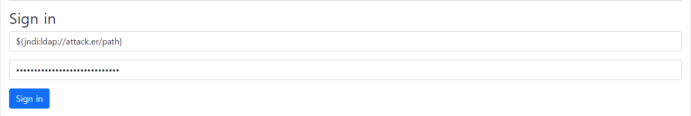

# ☕ ITF-log4shell-vulnapp
log4j (CVE-2021-44228) Spring-boot web application with vulnerabilities

## Installation & Launch
```bash
$ git clone https://github.com/ITF-Education/ITF-log4shell-vulnapp.git
$ cd ITF-log4shell-vulnapp
$ docker build -t itf-log4shell-vulnapp .
$ docker run -r 8080:8080 --name itf-log4shell-vulnapp itf-log4shell-vulnapp
```
If you want to change a port of application, you can change a port by edit application.properties
```bash
$ cd ITF-log4shell-vulnapp/src/main/resources
$ vi application.properties
```
and add or edit port setting (default port number is 8080):
```bash
server.port = 8080
```

## Attack Point
The controller uses log4j to output Username and password parameter values included in the POST request sent from the sign in page as logs.   
You can attack by inserting and submitting JNDI phrases to username and password as follows.
