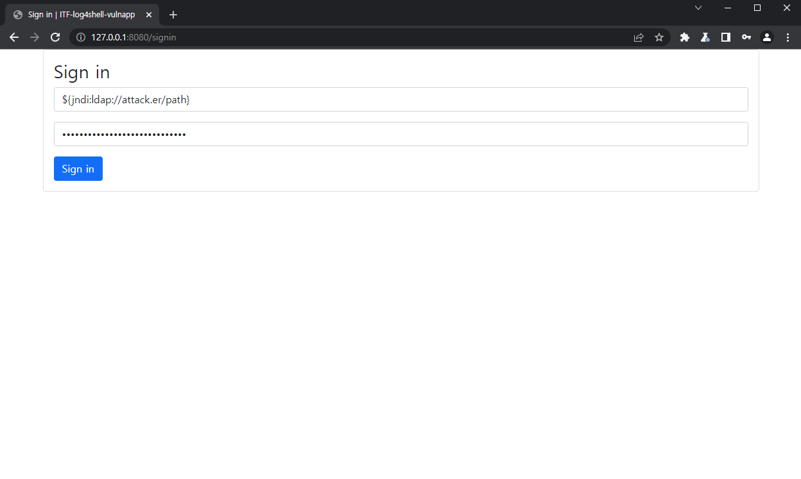

# ☕ ITF-log4shell-vulnapp

Spring-boot web application with log4shell(CVE-2021-44228) vulnerabilities

## Installation

```bash
# requierd JDK version 8
$ git clone https://github.com/Auddn/ITF-log4shell-vulnapp.git
$ cd ITF-log4shell-vulnapp
$ ./gradlew build
$ ./gradlew bootJar
```

If `JDK 8` is not installed in your system, follow:

```bash
$ apt-get update
$ apt-get install openjdk-8-jdk
$ vi /etc/profile
```

and add `$JAVA_HOME` in vim

```bash
$JAVA_HOME="/usr/lib/jvm/java-8-openjdk-amd64"
```

apply and check the `JAVA_HOME` environmental variable.

```bash
$ source /etc/environment
$ echo $JAVA_HOME
/usr/lib/jvm/java-8-openjdk-amd64
```

## Setting & Execute

This web application operates based on the Spring-Boot framework and has Tomcat built-in.

If you have successfully completed the installation process, run the application through the following process:

```bash
$ cd ITF-log4shell-vulnapp/build/libs
$ java -jar log4shellVulnapp-0.0.1-SNAPSHOT.jar
```

If you want to change a port of application, you can change a port by edit application.properties

```bash
$ cd ITF-log4shell-vulnapp/src/main/resources
$ vi application.properties
```

and add or edit port setting (default port number is 8080):

```bash
server.port = 8080
```

## Vulnerabilities test

In order to test for log4j vulnerabilities in this application, the payload must be inserted as follows:

